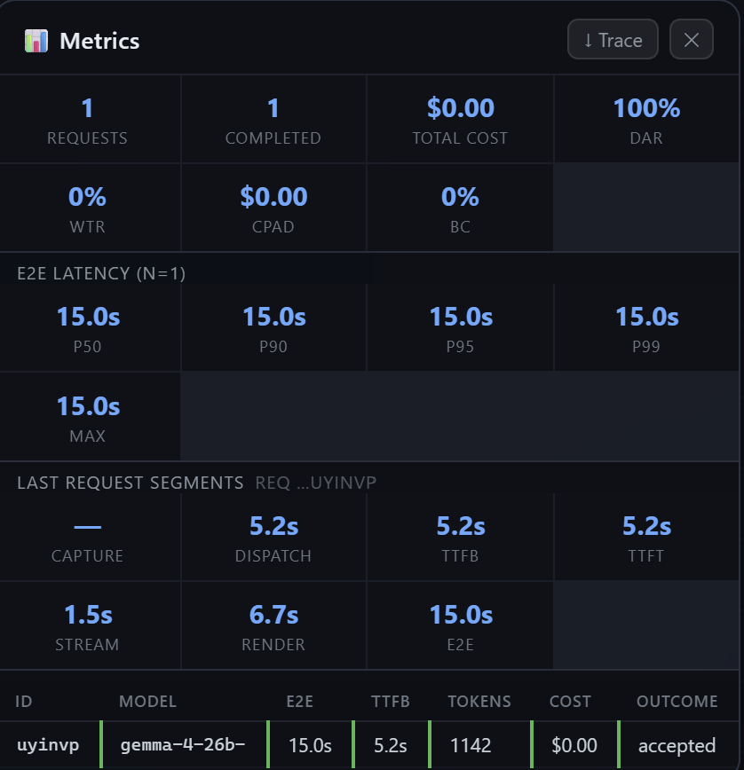

# METRICS

## 1. Purpose

Every AI request is instrumented through the same request lifecycle so latency, token usage, cost and outcome can be compared across normal use and controlled experiments.

The assignment requires six latency segments and p50/p90/p95/p99/max/n reporting. filecite references are intentionally kept out of repository docs; this file is self-contained.

## 2. Trace schema

One JSON object represents one request. The production schema records the following logical fields:

```json
{
  "request_id": "req_...",
  "session_id": "ses_...",
  "ts_start": "ISO-8601",
  "trigger": "explicit",
  "provider": "OpenRouter",
  "model": "google/gemma-4-26b-a4b-it:free",
  "config_id": "cfg_...",
  "input": {
    "crop_px": [1024, 768],
    "format": "webp",
    "bytes": 70476,
    "zoom": 1.0,
    "stroke_count": 300,
    "prompt_chars": 812
  },
  "latency_ms": {
    "t_capture": 61,
    "t_dispatch": 18,
    "ttfb": 940,
    "ttft": 1180,
    "t_stream": 3420,
    "t_render": 44,
    "e2e": 5663
  },
  "tokens": {
    "input_text": 214,
    "input_image": null,
    "input_image_source": "not_reported",
    "output": 388,
    "reasoning": 0,
    "cache_read": 0,
    "total": 2731
  },
  "cost_usd": 0,
  "outcome": "accepted",
  "error": null,
  "retries": 0
}
```

The exact runtime record may contain additional implementation-specific fields.

## 3. Latency segments

| Segment | Definition |
|---|---|
| `t_capture` | Request trigger through ROI capture and image encoding |
| `t_dispatch` | Encoded payload through provider request dispatch |
| `ttfb` | Provider dispatch through first response byte |
| `ttft` | Provider dispatch through first content token |
| `t_stream` | First content token through final content token |
| `t_render` | Final content token through visible canvas draft |
| `e2e` | Request trigger through visible draft |

For every segment, report **p50, p90, p95, p99, max and n** when enough observations exist.

## 4. Token accounting

The provider-reported total token count is preserved when available. The current OpenRouter/Gemma route used for the experiment did not provide a separate `input_image_tokens` value in the exported rows.

Gemma 4 supports variable visual-token budgets of 70, 140, 280, 560 and 1120 visual tokens; higher budgets preserve more visual detail at higher compute cost. The model documentation describes the visual-token budget as the control for image representation. Because the current application trace does not record the selected visual-token budget or a provider-reported image-token field, this project does **not** fabricate an image-token estimate.

**Validated image-token estimator error: N/A for the current trace set.** This is a documented limitation rather than an invented validation result.

## 5. Cost

The production pricing registry is configuration-driven. The actual experiment used the free Gemma 4 26B A4B route, so measured `costUsd` values are `$0.00`.

For a paid/notional comparison, OpenRouter currently lists the non-free `google/gemma-4-26b-a4b-it` at approximately **$0.07 / 1M input tokens and $0.34 / 1M output tokens** on its model page; provider-specific pricing can differ. The free route is listed as free.

Source:
- https://openrouter.ai/google/gemma-4-26b-a4b-it/api
- https://openrouter.ai/google/gemma-4-26b-a4b-it%3Afree/pricing

Rate date: **2026-08-14**.

Cost formula used by the application:

```text
cost = (input_tokens × input_rate
      + output_tokens × output_rate
      + reasoning_tokens × output_rate) / 1,000,000
```

## 6. KPI formulas

### CPAD — Cost per Accepted Draft

```text
CPAD = total spend / accepted drafts
```

### DAR — Draft Acceptance Rate

```text
DAR = accepted drafts / drafts returned
```

### WTR — Wasted Token Ratio

```text
WTR =
tokens spent on discarded/cancelled/superseded/timeout/error requests
/
all tokens
```

### Budget Compliance

```text
Budget Compliance =
requests meeting the declared E2E latency budget
/
requests with measurable E2E
```

Declared target: **p95 E2E ≤ 8 seconds**.

## 7. Example live panel



The supplied panel screenshot demonstrates  per-request outcome/token information.

## 8. Experiment fields

The controlled experiment additionally records:

- benchmark ID
- arm ID
- repetition index
- raster resolution
- WebP quality
- stroke count
- retry state
- E2E latency
- TTFB
- input/output/total tokens
- cost
- encoded image bytes
- raster width/height
- error message

This makes each experiment cell independently auditable.
